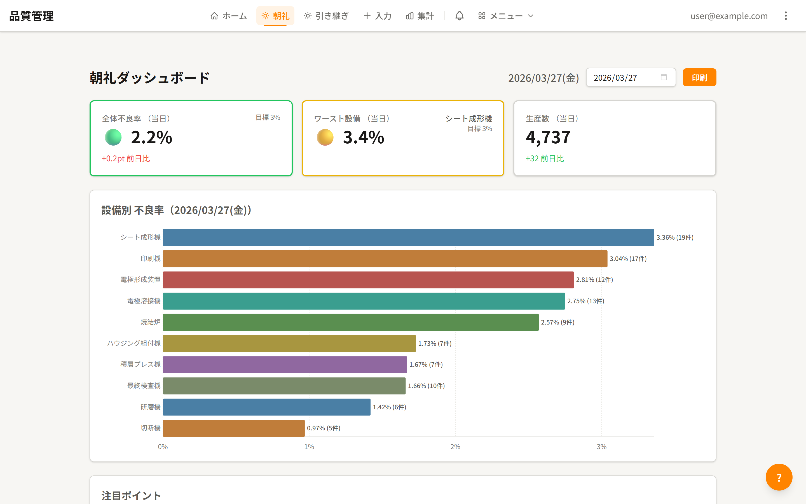
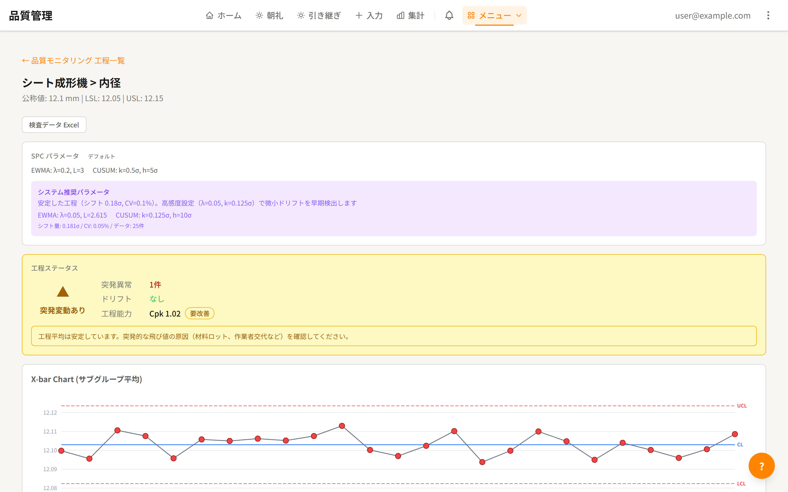

# 品質管理システム構築記

プログラミング未経験の製造現場の人間が、AIと品質管理システムを作った話 -- その記事のソースコードです。

> 記事: [GitHub Pages で公開中](https://sakepx.github.io/hinshitsu-kanri-article/)

## スクリーンショット

### 朝礼ダッシュボード

### SPC（統計的工程管理）チャート

## 技術スタック

- HTML
- CSS

静的サイトとして構築しています。

## ライセンス

[CC BY 4.0](./LICENSE)
